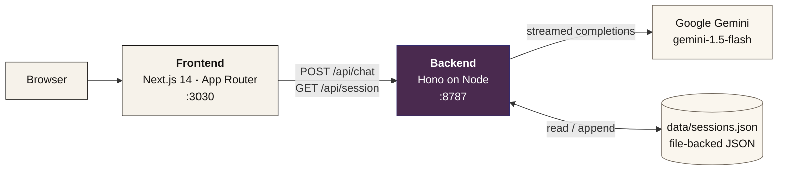
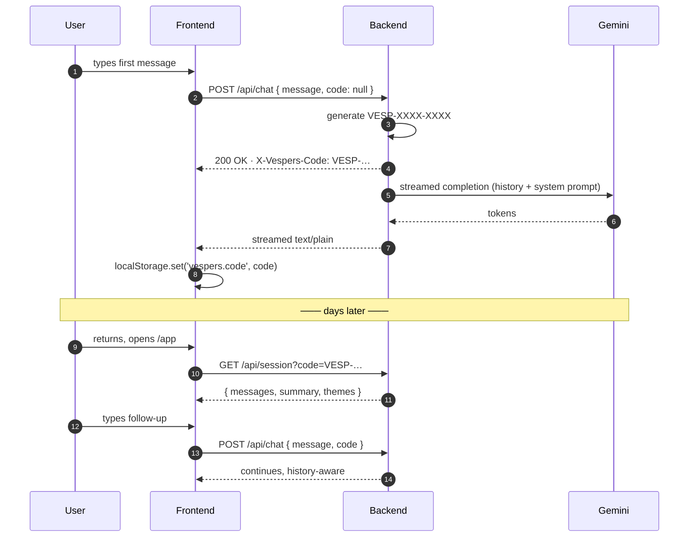

<p align="center">
  
</p>

<h1 align="center">Vespers</h1>

<p align="center">
  <i>A quiet place for difficult evenings.</i><br/>
  A calm, premium emotional wellness companion. Anonymous by design — no account, no inbox, just a private recovery code.
</p>

<p align="center">
  <a href="#local-development">Local development</a> ·
  <a href="#user-flow">User flow</a> ·
  <a href="#architecture">Architecture</a> ·
  <a href="#api-reference">API</a> ·
  <a href="#privacy-posture">Privacy</a> ·
  <a href="#deploy">Deploy</a>
</p>

---

## At a glance

Vespers is a two-part web app that lets anyone have a thoughtful, low-stakes conversation about how they're feeling — at any hour, with no sign-up. The whole product is shaped around a single promise: *the conversation is yours, and travels nowhere else.*

- **Anonymous by design** — no account, no email, no profile.
- **Private recovery codes** — `VESP-XXXX-XXXX` is the only thread back to your conversation; only you keep it.
- **Editorial design** — paper, ink, and calligraphy; built to feel like a hand-bound journal, not a SaaS dashboard.
- **Streaming responses** powered by Google Gemini.
- **File-backed memory** out of the box; trivially swappable for KV / Redis / Postgres.

## Why

Most "mental wellness" software either asks you to sign up before it earns your trust, or hides the conversation behind a clinical UI. Vespers inverts that: the page itself is the calm. Reading the landing — slowly — *is* the demo. Beginning a session is one click, no fields, no friction.

The product is **not** a substitute for medical, psychiatric, or emergency care. It's a quiet companion for the in-between days.

---

## User flow

The whole product holds three flows: a first visit, a returning visit, and the privacy contract that surrounds both.

```mermaid
flowchart LR
    classDef paper fill:#F6F2EA,stroke:#161412,color:#161412
    classDef ink   fill:#4A2A4F,stroke:#322A6E,color:#FFFFFF

    A[Visitor]:::paper -->|lands on /| B[Editorial Landing<br/>ten movements]:::paper
    B -->|begin a session| C[/app]:::paper
    C -->|first message| D[backend generates<br/>VESP-XXXX-XXXX]:::ink
    D --> E[code returned in<br/>X-Vespers-Code header]:::ink
    E --> F[Gemini streams reply<br/>memory persisted]:::ink

    G[Returning user]:::paper -->|paste code| H[recovery-code pill]:::paper
    H -->|GET /api/session| I[transcript restored]:::paper
    I --> F
```

### What a first-time visitor sees

1. Lands at `/` — an editorial landing with **ten movements** (the open, the whisper, the letter, the anatomy of a difficult day, the companion, the index, the practice, the unsigned, the close, the footnote).
2. Reads through the page (or skims). The hero asserts the privacy promise as a letterpress dateline directly under the calligraphic wordmark.
3. Clicks **begin a session** → arrives at `/app`.
4. Either taps a suggested *opening* or types their own first message.
5. The backend generates a private recovery code and streams the model's reply. The code is shown in the header pill and saved to `localStorage` so the user doesn't lose it.

### What a returning user does

1. Opens `/app` — the previously saved code is loaded automatically and the transcript is rehydrated.
2. If they're on a new device: open the recovery-code pill, paste their `VESP-XXXX-XXXX`, and the conversation continues mid-thought.

---

## Architecture

Two cleanly separated halves talking over HTTP. The frontend ships only UI; the backend owns the API, the memory, and the model integration.



### Session lifecycle (sequence)



---

## Repository layout

```
vespers/
├── README.md                      ← you are here
├── frontend/                      Next.js 14 — landing + chat UI
│   ├── app/
│   │   ├── layout.tsx             root layout, fonts, metadata
│   │   ├── globals.css            paper / ink design tokens
│   │   ├── icon.svg               calligraphic V favicon
│   │   ├── page.tsx               landing — ten movements
│   │   └── app/page.tsx           the chat UI
│   ├── components/
│   │   ├── ChatInput.tsx
│   │   ├── MessageBubble.tsx      transcript-style turns
│   │   ├── RecoveryCodePill.tsx
│   │   └── marketing/
│   │       ├── WordmarkVespers.tsx
│   │       ├── SectionShell.tsx
│   │       ├── Reveal.tsx         scroll-triggered fade
│   │       ├── SmoothScroll.tsx   Lenis
│   │       ├── PaperSurface.tsx
│   │       └── Movement*.tsx      one component per movement
│   ├── lib/
│   │   ├── api.ts                 BACKEND_URL helper
│   │   └── recovery-code.ts       client-safe regex / format
│   └── …configs (next, tailwind, postcss, tsconfig)
└── backend/                       Hono API on Node
    ├── src/
    │   ├── server.ts              entry — Hono + CORS + routes
    │   ├── routes/
    │   │   ├── chat.ts            POST /api/chat (streamed)
    │   │   └── session.ts         GET /api/session
    │   └── lib/
    │       ├── prompt.ts          Vespers system prompt
    │       ├── memory.ts          file-backed JSON store
    │       └── recovery-code.ts   VESP-XXXX-XXXX generator
    ├── data/                      sessions.json lives here (gitignored)
    └── …configs (tsconfig, env)
```

---

## Stack

| Layer            | Choice                                    | Why                                                            |
| ---------------- | ----------------------------------------- | -------------------------------------------------------------- |
| Frontend runtime | Next.js 14 (App Router)                   | Fast, modern, RSC, easy Vercel deploy                          |
| Styling          | Tailwind CSS                              | Lean utility CSS for an editorial design system                |
| Animation        | Framer Motion + Lenis                     | Reveal-on-view + buttery smooth scroll                         |
| Typography       | Fraunces · Allura · Inter · JetBrains Mono | Display serif · calligraphy · body sans · mono for eyebrows    |
| Backend runtime  | Hono on `@hono/node-server`               | ~25 KB, Web-standard streams, deploys to Node / CF / Bun       |
| AI model         | Google Gemini (`gemini-1.5-flash` default) | Free-tier friendly, fast streaming                            |
| Memory           | File-backed JSON (`data/sessions.json`)   | Zero setup; swap to KV / Redis / Postgres at any time          |
| Auth             | None — recovery codes (`VESP-XXXX-XXXX`)  | Anonymity is a feature, not an oversight                       |

---

## Local development

You'll need two terminals — one per service.

### Prerequisites
- Node.js **18.18+** (Hono 4 requires modern Node).
- A Google Gemini API key — free at <https://aistudio.google.com/apikey>.

### 1) Backend
```bash
cd backend
cp .env.example .env
# edit .env and paste your GEMINI_API_KEY
npm install
npm run dev
# → vespers backend → http://localhost:8787
```

### 2) Frontend
```bash
cd frontend
cp .env.example .env.local      # default points at http://localhost:8787
npm install
npm run dev
# → http://localhost:3000
```

Visit:
- **/** → the editorial landing
- **/app** → the chat

### Verifying it's wired up
```bash
# backend health
curl http://localhost:8787/health

# CORS preflight (should return access-control-allow-origin)
curl -X OPTIONS \
  -H 'Origin: http://localhost:3000' \
  -H 'Access-Control-Request-Method: POST' \
  -i http://localhost:8787/api/chat
```

---

## Environment variables

### Backend (`backend/.env`)

| Variable          | Required | Default              | Notes                                                                     |
| ----------------- | :------: | -------------------- | ------------------------------------------------------------------------- |
| `GEMINI_API_KEY`  | ✅       | —                    | Get one at <https://aistudio.google.com/apikey>.                          |
| `GEMINI_MODEL`    |          | `gemini-1.5-flash`   | Any Gemini model id. Flash is free-tier friendly; Pro is higher quality.  |
| `PORT`            |          | `8787`               | Port the API listens on.                                                  |
| `FRONTEND_ORIGIN` |          | `http://localhost:3030` | Comma-separated allowlist for CORS. Add your prod frontend host here. |

### Frontend (`frontend/.env.local`)

| Variable                   | Required | Default                  | Notes                                              |
| -------------------------- | :------: | ------------------------ | -------------------------------------------------- |
| `NEXT_PUBLIC_BACKEND_URL`  | ✅       | `http://localhost:8787`  | Where the backend lives (the browser will see it). |

---

## API reference

### `POST /api/chat`

Streams the model's reply as `text/plain`. Generates and returns a recovery code on the first call.

**Request**
```json
{
  "message": "i've been feeling stretched thin lately.",
  "code": "VESP-7Q9F-X41M"   // optional; null/missing → new session
}
```

**Response headers**
| Header                    | Meaning                                                |
| ------------------------- | ------------------------------------------------------ |
| `X-Vespers-Code`          | The recovery code for this session.                    |
| `X-Vespers-New-Session`   | `1` if a new session was created on this request.      |
| `Content-Type`            | `text/plain; charset=utf-8` (streamed).                |

**Response body** — streamed plain-text tokens. Read with a fetch `ReadableStream`.

**Status codes**
- `200` streaming reply
- `400` invalid JSON or empty message
- `503` `GEMINI_API_KEY` not configured

### `GET /api/session?code=VESP-XXXX-XXXX`

Returns the stored history for a recovery code.

**Response (200)**
```json
{
  "ok": true,
  "code": "VESP-7Q9F-X41M",
  "messages": [
    { "role": "user",  "content": "...", "ts": 1700000000000 },
    { "role": "model", "content": "...", "ts": 1700000000001 }
  ],
  "summary": "",
  "themes": []
}
```

**Status codes** — `400` invalid code · `404` not found.

---

## Privacy posture

The privacy promise is the product. The backend enforces it; the system prompt reinforces it.

- 🚫 **No accounts.** No email, password, OAuth, or profile.
- 🔑 **One private code, only yours.** `VESP-XXXX-XXXX` is the only key to your transcript. Lose it, and the thread closes with you.
- 🚫 **No tracking.** No analytics on your conversation, no cross-site tags, no third-party SDKs.
- 🚫 **Never stored.** No passwords, payments, addresses, phone numbers, or government identifiers — even if you mention them, the system prompt steers the model away.
- 🛡 **CORS allowlisted.** The backend only accepts requests from `FRONTEND_ORIGIN`.
- ⚠️ **Not a substitute** for medical, psychiatric, or emergency care. The crisis-handling section of the system prompt nudges users toward local emergency services and trusted humans.

---

## Deploy

The two halves deploy independently — that's the point of the split.

### Frontend (Vercel · Netlify · Cloudflare Pages)
1. Point your host's project root at `frontend/`.
2. Build command: `npm run build` · Output dir: `.next` (Vercel auto-detects).
3. Set env: `NEXT_PUBLIC_BACKEND_URL=https://<your-backend-host>`.

### Backend (Railway · Render · Fly.io · any Node host)
1. Point your host's project root at `backend/`.
2. Build: `npm run build` · Start: `npm start` (or `npm run dev` on dev hosts).
3. Set env: `GEMINI_API_KEY`, `FRONTEND_ORIGIN=https://<your-frontend-host>`. Optional: `GEMINI_MODEL`, `PORT`.
4. Mount a persistent volume at `backend/data/` if you want session memory to survive redeploys (or swap the memory backend — see below).

### Cloudflare Workers / Bun
Hono runs natively on both. The only thing to swap is `lib/memory.ts` (the file-backed store) for Workers KV, D1, Durable Objects, or whatever store fits.

### CORS
Production frontends fail CORS unless their origin is in `FRONTEND_ORIGIN` (comma-separated). Example:
```
FRONTEND_ORIGIN=https://vespers.app,https://www.vespers.app
```

---

## Customization

| Want to…                                | Edit                                              |
| --------------------------------------- | ------------------------------------------------- |
| Reword the model's persona              | `backend/src/lib/prompt.ts`                       |
| Change the model                        | `GEMINI_MODEL` env (or `routes/chat.ts` default)  |
| Use a database instead of JSON          | Reimplement the four exports of `lib/memory.ts`   |
| Tweak temperature / token budget        | `routes/chat.ts` → `generationConfig`             |
| Adjust the recovery-code format         | `lib/recovery-code.ts` (mirror in both packages)  |
| Restyle the landing                     | `frontend/components/marketing/Movement*.tsx`     |
| Recolor the brand                       | `frontend/tailwind.config.ts` + `app/globals.css` |
| Replace the favicon                     | `frontend/app/icon.svg`                           |

---

## Scripts

### Backend
| Command           | What it does                              |
| ----------------- | ----------------------------------------- |
| `npm run dev`     | `tsx watch src/server.ts` — hot reload    |
| `npm run build`   | `tsc` — emit JS to `dist/`                |
| `npm start`       | `node dist/server.js` — production        |
| `npm run typecheck` | `tsc --noEmit`                          |

### Frontend
| Command         | What it does                |
| --------------- | --------------------------- |
| `npm run dev`   | `next dev`                  |
| `npm run build` | `next build`                |
| `npm start`     | `next start`                |
| `npm run lint`  | `next lint`                 |

---

## Roadmap

- [ ] Mood timeline view (the `Practice` "trace" ritual)
- [ ] Daily check-in nudge
- [ ] Optional Postgres / KV memory adapter
- [ ] Self-hosted Whisper / faster-whisper for voice input
- [ ] Export-your-data button (download as `.txt` or `.json`)
- [ ] LICENSE file (currently unlicensed — please add one before sharing publicly)

---

## Acknowledgements

- The editorial design takes inspiration from letterpress journals and modern editorial typography (Fraunces, GT Alpina, Editorial New).
- The crisis-handling guidance is informed by general best practice; it is not a substitute for clinical training.

---

> *unsigned, unread, unstored — except by you, and the quiet model that replies in the moment.*
