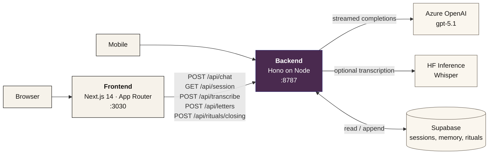
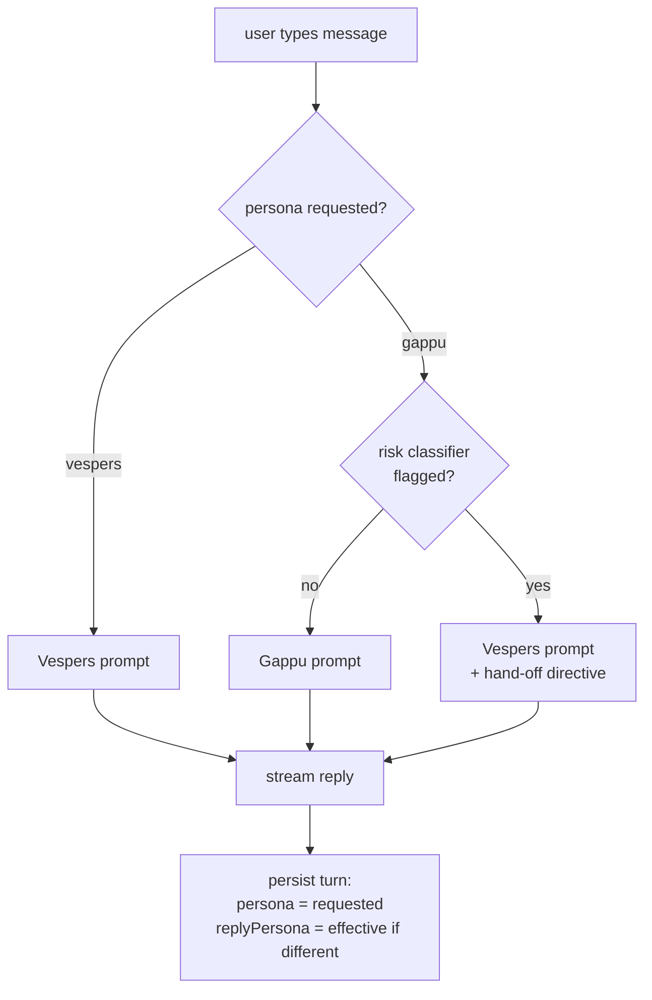

<p align="center">
  
</p>

<h1 align="center">Vespers</h1>

<p align="center">
  <i>A quiet place for difficult evenings — and a louder room for the ones in between.</i><br/>
  An anonymous emotional-wellness companion with two voices: <b>Vespers</b> (calm) and <b>Gappu</b> (Hinglish chatterbox). No account, no inbox, just a private recovery code.
</p>

<p align="center">
  <a href="#feature-tour">Feature tour</a> ·
  <a href="#architecture">Architecture</a> ·
  <a href="#local-development">Local development</a> ·
  <a href="#api-reference">API</a> ·
  <a href="#environment-variables">Env</a> ·
  <a href="#privacy-posture">Privacy</a>
</p>

---

## At a glance

- **Two personas, one private thread** — Vespers (calm, CBT-flavoured) and Gappu (warm, mischievous, Hinglish). Switchable inside the chat; each persona has its own filtered transcript.
- **Anonymous by design** — no account, no email, only a private `VESP-XXXX-XXXX` recovery code the user alone keeps.
- **Crisis-aware** — heuristic risk classifier on every user message; if Gappu is on and a message looks distressed, Vespers transparently steps in for that turn.
- **Editorial design** — letterpress paper feel, hand-bound typography (Fraunces · Allura · Inter · JetBrains Mono).
- **Streaming responses** powered by **Azure OpenAI (GPT-5.1)**.
- **Persistent memory** in Supabase, with automatic background summarisation.
- **Quiet objects** to escape to when words feel like too much — koi pond, watercolour, candle.
- **Animated Gappu mascot** with cursor-tracking eyes and the occasional peek at your textbox.

---

## Feature tour

### 1) Two companions, one thread

| | Vespers | Gappu |
| --- | --- | --- |
| Voice | Calm, careful, CBT-flavoured English | Warm, mischievous, Hinglish (Roman script) |
| Use it when | You want to be heard, sorted, taught something | You want a friend, a laugh, a small mood shift |
| Length | 2–6 sentences, full paragraphs | 1–4 lines, punchy |
| Temperature | 0.85 | 0.95 |
| Bubble style | Paper / ink, italic blockquotes, classic | Paper / ink (matches Vespers; label colour is the persona signal) |

- **Persona toggle** in the chat header. Selected pill animates between them with a shared `layoutId` morph.
- **Per-thread filtering** — switching personas swaps the visible transcript. The Vespers thread and the Gappu thread do not bleed into each other.
- **Per-code persistence** — your last-used companion is restored when you return with the same recovery code (`vespers.persona.<code>` in localStorage).
- **System notices on switch** — slim, centred line in each thread announcing arrival: *"switched to gappu — ready to talk bakwaas"* / *"switched to vespers — soft landing"*.
- **Persona-aware empty state** — Vespers gets *"take a slow breath. what's been weighing on you tonight?"*; Gappu gets *"oye, kya scene hai aaj?"* with Hinglish openers ("yaar mood off hai, kuch bata na", "boss roast me kar do thoda…").
- **Shared memory** — both personas read the same structured memory (themes, concerns, coping wins). The memory itself is persona-agnostic; the voice answering it differs.

### 2) Crisis hand-off

Heuristic risk classifier (in-process, never logged externally) runs on every user message.

- If **Vespers** is active and a message is flagged, the assistant gets a presence directive (stay close, no resource lists) and the UI shows a crisis-support banner with helplines.
- If **Gappu** is active and a message is flagged, the backend transparently **flips effective persona to Vespers for that single turn**. The Gappu mascot drops to `idle`, the bubble renders as Vespers, and a slim system notice appears: *"gappu stepped aside — vespers is here for this one"*. The reply still belongs to the Gappu thread (so the user sees a coherent conversation), but a `replyPersona` field keeps the stand-in styling after reload.
- Persona preference is **not** changed by the override. The next turn returns to Gappu unless the user toggles otherwise.

The Vespers system prompt explicitly forbids resource lists in crisis turns — the UI is responsible for surfacing helplines; the model's job is presence.

### 3) Vespers professional teaching layer

Vespers can name well-known **psychological concepts** (not diagnoses) and suggest **named research-backed techniques** when it would genuinely help — roughly one in three exchanges, never during acute distress.

- Concepts it can name: rumination · catastrophising · cognitive distortion · all-or-nothing thinking · the acute stress response · anticipatory anxiety · decision fatigue · negativity bias · emotional avoidance · imposter feelings · the inner critic · hedonic adaptation · the window of tolerance · co-regulation.
- Techniques it can suggest by name: 4-7-8 breathing · box breathing · physiological sigh · 5-4-3-2-1 grounding · cognitive defusion · behavioural activation · urge surfing · opposite action · thought record · self-compassion break · worry postponement · progressive muscle relaxation.
- Strict bright line — **concepts and techniques YES, diagnoses NO**. The prompt carries side-by-side OK / NOT-OK examples so the model has a tight rule for edge cases (no "you have anxiety disorder", no SSRI suggestions, etc.).

### 4) Gappu — the Hinglish chatterbox

- ~70% Hindi words / 30% English in **Roman script only** (no Devanagari).
- Short and punchy (1–4 lines for jokes, max 6 lines otherwise).
- Roasts the situation, never the user. Always lovingly.
- Fair-game references: Bollywood, cricket, IPL, chai, Indian moms, traffic, hostel life, monsoons, exam season.
- **Hard guardrails** baked into the prompt: never jokes about self-harm/suicide, mental-illness diagnoses, religion, caste, gender slurs, body shaming, or politics.

### 5) Gappu mascot (anime avatar with personality)

A small SVG mascot appears above the input bar whenever Gappu is the active persona.

**Mood states**, all driven by the chat lifecycle:
- `idle` — neutral peek, gentle smile, blinks every 2.5–5s
- `thinking` — eyes glance up, brows tilt, flat mouth, three dots pulse overhead (just after user sends)
- `talking` — mouth flaps open/closed at ~5Hz while a stream is in flight
- `laughing` — closed `^_^` arcs, wide mouth, cheek blush, temple sparkles (triggered briefly when stream content contains laughter — `haha`, `lol`, `lmao`, `😂`, `🤣`, etc.)
- `smiling` — wider grin + soft blush (settled mood after a laughy reply)

**Cursor & input interaction**:
- **Eye tracking** — pupils follow your mouse, lerped (~18%/frame, ~30fps cap, no rerender when the mouse is still).
- **Periodic textbox peek** — while the input is focused, every 3.5–6.5s Gappu briefly glances at your textbox: head tilts ~6°, raised curious brows, mouth becomes a small "o", cheeks blush. Done in ~700–1000ms.

**Visual identity** — spiky boy haircut with multiple peaks, small ear nubs, short triangular sideburn flecks, thick always-visible boy brows that re-shape per mood (straight base / pulled-up worried for thinking / curious raised for peek), rounder less-anime-tall eyes.

**Optimisation** — single inline SVG. One global mousemove listener writes to a ref (zero rerenders). One rAF loop, throttled to ~30fps, skips state updates when the new pupil offset is within 0.18 SVG units of the current one. All timers cleaned up when persona switches back to Vespers.

### 6) Koi pond (`/play/koi`)

A canvas-based interactive scene. The pond is the rest-stop when words feel like too much.

**Fish behaviour**:
- **Click anywhere in the water** → every koi steers toward the click, slows on arrival, glides through, and resumes ambient drift. No distance gate — a click across the pond pulls fish across the pond.
- **Click on a fish** → that fish (and any koi within 220px) flees away from the click with a 1.6–3× speed boost and sharper turn rate. No ripple is spawned at the click; no secondary splash ripples shed off the dart (so you don't get a vibrating-on-the-click cascade).
- **Throw food toggle** in the header — turns clicks into pellets. Pellets sink slowly with drag; fish detect them within 360px, target the nearest, and **eat with a brief animation** (mouth opens/closes, body wobble) when within 20px. Pellet auto-disappears after 14s.
- **Hard screen border** — fish never leave the canvas. Soft inward steering inside a 70px margin curves them back; hard clamp at 14px with heading reflection (`heading = π − heading` on x-walls, `−heading` on y-walls) is the safety net.

**Variety** — no two koi look alike:
- **7 hue palettes**: peach, blush, navy, kohaku (cream + red), gold, charcoal, ghost.
- **5 patterns**: dual spots, stripe (back band), speck (3 dots), split (large half-body block), clean (solid).
- **3 size classes**: small/fast juveniles, mid, large/slow matriarchs (speed inversely scaled with size).
- A shuffled catalog (`buildKoiCatalog`) hands out distinct (hue, pattern) slots first; per-fish `accentSeed` further jitters accent placement so even same-(hue, pattern) twins read as individuals.

**Adaptive quality** — three tiers (`high` / `medium` / `low`) auto-selected from device hints (`deviceMemory`, `hardwareConcurrency`, `prefers-reduced-motion`, save-data). Runtime FPS monitor steps down at >40ms average frame time. Caps:

| Tier | DPR | Koi | Ripples | Particles | Lilies | Stones | Food | idle / active fps |
| --- | --- | --- | --- | --- | --- | --- | --- | --- |
| high | 1.5 | 9 | 8 | 6 | 3 | 5 | 6 | 30 / 60 |
| medium | 1.25 | 7 | 6 | 4 | 2 | 4 | 5 | 30 / 60 |
| low | 1.0 | 5 | 4 | 3 | 1 | 3 | 3 | 24 / 30 |

**Ambient scenery** — drifting lotus pads (with one pulsing flower bud), pond-floor stones, light caustics (cached gradients), vignette, and an idle scheduler that occasionally drops a petal flurry, awakens fireflies, plays a chime, or biases the koi to gather toward the centre. Sound is muted by default; mute preference persists in localStorage.

**Other**: ripple animation is age-clamped to avoid negative-radius crashes on first click; idle-FPS cap kicks in after 5s of no input.

### 7) Quiet objects

| | Path | What it is |
| --- | --- | --- |
| koi pond | `/play/koi` | Tap the water. The fish come, in their own time. |
| watercolour | `/play/wash` | Drop colours on paper, watch them bloom. |
| candle | `/play/candle` | Light a small candle, sit with it, blow it out. |

Both Vespers (system prompt) and Gappu (in his own voice) can sparingly offer one of these as a soft invitation when the user seems overwhelmed.

### 8) Letters

A short writing surface separate from the live conversation — `/letters` (index) and `/letters/new`. Each letter is keyed to the recovery code and shows up alongside the session memory. Lets the user write *to themselves* when the back-and-forth isn't what they need.

### 9) Closing ritual

After **10 minutes of inactivity** in a meaningful conversation (≥4 messages), a soft modal asks three things: *what are you carrying · what are you releasing · what's your intention*. It's a non-blocking offer (dismissable), with a **6-hour cooldown** so it doesn't appear repeatedly in the same session.

### 10) Recovery codes

`VESP-XXXX-XXXX` — generated server-side on the first message and returned in the `X-Vespers-Code` response header. Stored in `localStorage` so the user doesn't lose it.

- **Returning user** — code is auto-loaded, transcript is rehydrated, persona pref is restored.
- **Different device** — paste the code into the recovery-code pill in the header to restore the thread.
- **Start new** — non-destructive walk-away (the server row stays; the user can paste the old code back any time).
- **Forget** — permanent deletion of the session row from the server, with confirmation dialog.

### 11) Streaming with multiple metadata channels

The chat reply streams over `text/plain`. Metadata travels in response headers, never in the body:

- `X-Vespers-Code` — recovery code for this session
- `X-Vespers-New-Session` — `1` if a fresh session was created on this request
- `X-Vespers-Persona` — persona that actually answered (the *effective* persona)
- `X-Vespers-Persona-Requested` — persona the user selected
- `X-Vespers-Risk-Level` — `none` / `elevated` / `acute` (advisory only)
- `X-Vespers-Risk-Category` — optional sub-category (advisory only)
- `X-Vespers-Show-Support` — `1` when the crisis banner should show

### 12) Memory & summarisation

Each session row in Supabase carries structured memory:

- `emotionalThemes` · `recurringConcerns` · `copingStrategies` · `personalWins`
- `unresolvedTopics` · `relationshipPatterns` · `summary`

A background **summariser** folds older messages into structured memory when the transcript grows beyond a threshold. The fold runs *after* the stream closes so the user never waits. Both personas read the same memory and quietly carry it forward; neither is allowed to list it back at the user.

### 13) Voice input (optional)

`POST /api/transcribe` accepts an audio blob and returns text. Pick one of two providers via env:

- **Azure OpenAI transcribe** (`AZURE_OPENAI_TRANSCRIBE_DEPLOYMENT`)
- **Hugging Face Inference API** with Whisper (`HF_API_TOKEN`)

No voice replies — output is always text.

### 14) Landing page (editorial essay)

Ten + sections of paper-and-ink editorial design.

```
hero (the open)            — wordmark, recovery-code specimen
hero-adjacent callout      — slim CTAs that surface before scrolling
§ 01 the whisper
§ 02 the letter
§ 03 the anatomy of a difficult day
§ 04 the companion         — a transcript demo of Vespers's voice
§ &  the other room        — two-companions showcase (Vespers + Gappu)
§ 05 the index
§ 06 the practice
§ 07 the unsigned
§ 08 the quiet close       — the same two CTAs anchor the bottom
footnote
```

- **Smooth scroll** via Lenis.
- **Reveal-on-view** fades via Framer Motion.
- **Editorial typography** — Fraunces (display serif) · Allura (calligraphy) · Inter (body) · JetBrains Mono (eyebrows).
- The slim hero-adjacent callout means visitors don't have to scroll the entire essay to find a CTA.

### 15) Mobile (Expo)

A sister React Native app under `mobile/` that talks to the same backend. Configured via `EXPO_PUBLIC_API_BASE` (must be your machine's LAN IP for physical-device dev, not `localhost`).

---

## Architecture

Three cleanly separated halves, all talking to the same backend over HTTP.



### Persona routing (per turn)



### Repository layout

```
Vespers/
├── README.md                       ← you are here
├── frontend/                       Next.js 14 — landing, chat, /play, /letters
│   ├── app/
│   │   ├── page.tsx                landing (movements + callout + companions)
│   │   ├── app/page.tsx            chat — persona toggle, threads, avatar
│   │   ├── letters/                writing surface
│   │   ├── play/
│   │   │   ├── koi/page.tsx        koi pond shell (food toggle UI lives here)
│   │   │   ├── wash/page.tsx       watercolour
│   │   │   └── candle/page.tsx     candle
│   │   ├── api/                    proxy routes forwarding to backend
│   │   ├── icon.svg                calligraphic V favicon
│   │   ├── globals.css             paper / ink design tokens
│   │   └── layout.tsx              root layout, fonts, metadata
│   ├── components/
│   │   ├── ChatInput.tsx
│   │   ├── MessageBubble.tsx       paper bubble + system-notice variant
│   │   ├── PersonaToggle.tsx       two-pill switch (Vespers / Gappu)
│   │   ├── GappuAvatar.tsx         SVG mascot with mood + gaze tracking
│   │   ├── CrisisSupport.tsx
│   │   ├── ClosingRitual.tsx
│   │   ├── RecoveryCodePill.tsx
│   │   ├── FullscreenToggle.tsx
│   │   ├── BackendStatus.tsx
│   │   └── marketing/              every Movement* + SectionShell + Reveal
│   └── lib/
│       ├── api.ts
│       ├── inactivity.ts
│       ├── risk.ts
│       ├── recovery-code.ts
│       └── pond/                   the koi pond engine
│           ├── Pond.ts             orchestrator
│           ├── Koi.ts              fish state, steering, hit-test, scare, eat
│           ├── Food.ts             pellet pool + draw
│           ├── Ripple.ts           ripple draw with age clamp
│           ├── Lily.ts             lotus pads + flower bud
│           ├── Stones.ts           static pond-floor stones
│           ├── Particles.ts        petals / motes / fireflies pool
│           ├── Audio.ts            optional ambient audio
│           ├── Idle.ts             idle scheduler (flurries, fireflies, chimes)
│           ├── Quality.ts          tier detection + runtime monitor
│           └── utils.ts            Pool, noise, math primitives
└── backend/                        Hono API on Node
    ├── src/
    │   ├── server.ts               entry — Hono + CORS + routes
    │   ├── routes/
    │   │   ├── chat.ts             POST /api/chat — persona routing, streaming
    │   │   ├── session.ts          GET / DELETE /api/session
    │   │   ├── letters.ts          letters CRUD
    │   │   ├── rituals.ts          closing ritual entries
    │   │   ├── resources.ts        crisis resources
    │   │   └── transcribe.ts       POST /api/transcribe (Azure or HF)
    │   └── lib/
    │       ├── prompt.ts           VESPERS_SYSTEM_PROMPT + composers
    │       ├── prompt-gappu.ts     GAPPU_SYSTEM_PROMPT + crisis hand-off
    │       ├── memory.ts           Session / Message / memory schema
    │       ├── memory-summary.ts   background summariser
    │       ├── risk.ts             heuristic risk classifier
    │       ├── recovery-code.ts    VESP-XXXX-XXXX generator + format
    │       └── supabase.ts         lazy client
    └── supabase/migrations/        SQL for the sessions table
```

---

## Local development

You'll need three terminals.

### Prerequisites

- Node.js **18.18+** (Hono 4 + Next 14).
- An **Azure OpenAI** deployment of GPT-5.1 (key, endpoint, deployment name).
- A **Supabase** project with the migration applied (see `backend/supabase/migrations`).

### 1) Backend

```bash
cd backend
cp .env.example .env       # fill in Azure + Supabase
npm install
npm run dev
# → vespers backend → http://localhost:8787
```

### 2) Frontend

```bash
cd frontend
cp .env.example .env.local # default proxies to http://localhost:8787
npm install
npm run dev -- -p 3030     # match the CORS allowlist
# → http://localhost:3030
```

The frontend uses **server-side proxy routes** (`/app/api/*`) that forward to the backend. The browser never sees the backend URL directly. Set `BACKEND_URL` (server env, not `NEXT_PUBLIC_*`) in production.

### 3) Mobile (optional)

```bash
cd mobile
cp .env.example .env       # EXPO_PUBLIC_API_BASE = http://<your LAN IP>:8787
npm install
npm start
```

### Health checks

```bash
curl http://localhost:8787/health
curl -I http://localhost:3030/app
```

---

## Environment variables

### `backend/.env`

| Variable | Required | Default | Notes |
| --- | :---: | --- | --- |
| `AZURE_OPENAI_API_KEY` | ✅ | — | server returns 503 without it |
| `AZURE_OPENAI_ENDPOINT` | ✅ | — | e.g. `https://your-resource.openai.azure.com` |
| `AZURE_OPENAI_DEPLOYMENT` | ✅ | — | GPT-5.1 deployment name |
| `AZURE_OPENAI_API_VERSION` | | `2024-12-01-preview` | |
| `SUPABASE_URL` | ✅ | — | persistence layer |
| `SUPABASE_KEY` *or* `SUPABASE_SERVICE_ROLE_KEY` | ✅ | — | one of them |
| `AZURE_OPENAI_TRANSCRIBE_DEPLOYMENT` | | — | optional voice input via Azure |
| `HF_API_TOKEN` | | — | optional voice input via Hugging Face Whisper |
| `HF_TRANSCRIBE_MODEL` | | `openai/whisper-large-v3` | |
| `PORT` | | `8787` | |
| `FRONTEND_ORIGIN` | ⚠ prod | `http://localhost:3030` | comma-separated CORS allowlist |

### `frontend/.env.local`

| Variable | Required | Default | Notes |
| --- | :---: | --- | --- |
| `BACKEND_URL` | | `http://localhost:8787` | server-side proxy target (note: it is **not** `NEXT_PUBLIC_*` — the browser never talks to the backend directly) |

### `mobile/.env`

| Variable | Required | Default | Notes |
| --- | :---: | --- | --- |
| `EXPO_PUBLIC_API_BASE` | ✅ | — | must be LAN IP for physical-device dev |

---

## API reference

### `POST /api/chat`

Streams the model's reply as `text/plain`. Generates a recovery code on the first call.

**Request**

```json
{
  "message": "i've been feeling stretched thin lately.",
  "code": "VESP-7Q9F-X41M",
  "persona": "vespers"
}
```

- `code` may be `null` / omitted on the first turn — one will be generated.
- `persona` defaults to `"vespers"` if omitted.

**Response headers** — see [Streaming with multiple metadata channels](#11-streaming-with-multiple-metadata-channels).

**Response body** — streamed plain-text tokens. Read with a `fetch` ReadableStream.

**Status codes**
- `200` streaming reply
- `400` invalid JSON or empty message
- `503` Azure OpenAI not configured / Supabase unavailable

### `GET /api/session?code=VESP-XXXX-XXXX`

Returns the stored history for a recovery code.

```json
{
  "ok": true,
  "code": "VESP-7Q9F-X41M",
  "messages": [
    { "role": "user",  "content": "...", "ts": 1700000000000, "persona": "vespers" },
    { "role": "model", "content": "...", "ts": 1700000000001, "persona": "vespers" },
    { "role": "user",  "content": "...", "ts": 1700000010000, "persona": "gappu" },
    { "role": "model", "content": "...", "ts": 1700000010001, "persona": "gappu" }
  ],
  "memory": { "emotionalThemes": [...], "summary": "..." },
  "closingRituals": [...]
}
```

Assistant messages may also carry an optional `replyPersona` field — set only when a crisis override flipped the effective persona away from the requested one.

### `DELETE /api/session?code=VESP-XXXX-XXXX`

Permanently removes the session row. Used by the "forget" action in the recovery-code pill.

### Other endpoints

| Method | Path | Purpose |
| --- | --- | --- |
| `GET` | `/health` | health + provider status |
| `POST` | `/api/transcribe` | voice → text (Azure or HF) |
| `GET` / `POST` | `/api/letters` | list / create letters |
| `GET` / `PUT` / `DELETE` | `/api/letters/:id` | read / update / delete a letter |
| `POST` | `/api/letters/:id/whisper` | summarise / reflect on a letter |
| `POST` | `/api/rituals/closing` | save a closing-ritual entry |
| `GET` | `/api/rituals/closing` | list past rituals |
| `GET` | `/api/resources` | curated crisis resources |

---

## Privacy posture

The privacy promise is the product. The backend enforces it; the system prompts reinforce it.

- 🚫 **No accounts.** No email, password, OAuth, or profile.
- 🔑 **One private code, only yours.** `VESP-XXXX-XXXX` is the only key to your transcript. Lose it, and the thread closes with you.
- 🚫 **No tracking.** No analytics on your conversation, no cross-site tags, no third-party SDKs.
- 🚫 **Never identifying data.** No passwords, payments, addresses, phone numbers, or government identifiers — even if you mention them, the system prompts steer the models away.
- 🛡 **CORS allowlisted.** The backend only accepts requests from `FRONTEND_ORIGIN`.
- 🩺 **Risk classification is local.** The classifier is a heuristic in the backend process; the user message is never sent to an external risk service. Risk headers travel separately from the body so they can't be logged together by accident.
- ⚠️ **Not a substitute** for medical, psychiatric, or emergency care. Both personas (in their own voices) nudge toward emergency services and trusted humans when needed.

---

## Stack

| Layer | Choice | Why |
| --- | --- | --- |
| Frontend runtime | Next.js 14 (App Router) | RSC, streaming, easy Vercel deploy |
| Styling | Tailwind CSS | utility-first, editorial design system |
| Animation | Framer Motion + Lenis | reveal-on-view + buttery smooth scroll |
| Typography | Fraunces · Allura · Inter · JetBrains Mono | display serif · calligraphy · body sans · mono eyebrows |
| Backend runtime | Hono on `@hono/node-server` | ~25 KB, web-standard streams |
| AI model | Azure OpenAI GPT-5.1 (default) | quality + streaming + private endpoint |
| Persistence | Supabase (Postgres) | hosted, RLS-aware |
| Voice input | Azure transcribe **or** HF Whisper | one-of, both optional |
| Auth | None — recovery codes | anonymity is a feature, not an oversight |
| Mobile | Expo (React Native) | shared backend, separate UI |

---

## Customisation

| Want to… | Edit |
| --- | --- |
| Reword Vespers's persona | `backend/src/lib/prompt.ts` |
| Reword Gappu's persona / guardrails | `backend/src/lib/prompt-gappu.ts` |
| Tune temperatures / token budget | `backend/src/routes/chat.ts` |
| Change the model | `AZURE_OPENAI_DEPLOYMENT` env |
| Adjust risk heuristic | `backend/src/lib/risk.ts` |
| Tweak summariser cadence | `backend/src/lib/memory-summary.ts` |
| Change recovery-code format | `backend/src/lib/recovery-code.ts` (mirror in `frontend/lib/recovery-code.ts`) |
| Add a new mood to the Gappu mascot | `frontend/components/GappuAvatar.tsx` |
| Restyle the persona toggle | `frontend/components/PersonaToggle.tsx` |
| Reshape the koi pond (counts, hues, patterns) | `frontend/lib/pond/Koi.ts`, `Quality.ts` |
| Add a new pond pattern or pellet behaviour | `frontend/lib/pond/Koi.ts`, `Food.ts` |
| Restyle the landing | `frontend/components/marketing/Movement*.tsx` |
| Recolor the brand | `frontend/tailwind.config.ts` + `app/globals.css` |

---

## Scripts

### Backend

| Command | What it does |
| --- | --- |
| `npm run dev` | `tsx watch src/server.ts` — hot reload |
| `npm run build` | `tsc` — emit JS to `dist/` |
| `npm start` | `node dist/server.js` — production |
| `npm run typecheck` | `tsc --noEmit` |

### Frontend

| Command | What it does |
| --- | --- |
| `npm run dev` | `next dev` |
| `npm run build` | `next build` |
| `npm start` | `next start` |
| `npm run lint` | `next lint` |

---

## Roadmap

- [ ] TTS / voice replies (currently text-only)
- [ ] Daily mood-lift card from Gappu / share-to-clipboard
- [ ] Cross-persona memory tagging
- [ ] Vibe meter slider on the Gappu side
- [ ] Mood timeline view tied to the closing-ritual data
- [ ] Self-hosted Whisper / faster-whisper for voice input
- [ ] Export-your-data button (`.txt` or `.json` per recovery code)
- [ ] LICENSE file

---

## Acknowledgements

- Editorial design inspired by letterpress journals and modern editorial typography (Fraunces, GT Alpina, Editorial New).
- Crisis-handling guidance informed by general best practice; not a substitute for clinical training.
- Gappu's voice exists because some nights call for a friend, not a session.

---

> *unsigned, unread, unstored — except by you, and the two quiet companions that reply in the moment.*
